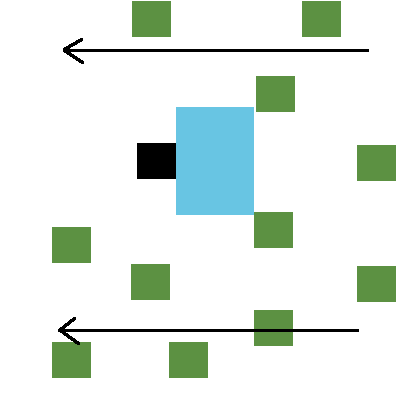
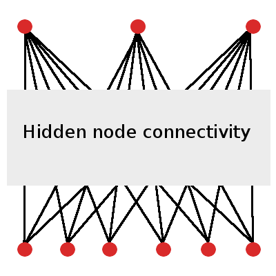

**Back to [Part 1: Introduction](01introduction.md)**

---

# Simulating Organisms that Learn

Biological organisms are intelligent in ways we hope to replicate in machines. There is a tremendous diversity of solutions of intelligence on our planet, and a theory of nervous systems should account for that diversity. A prominent way of thinking about the existence of a particular nervous system is the observation that it exists as a solution that is a product of both learning during the lifetime of that organism, as well as the evolutionary history of previous solutions that led to it. 

It may not always be necessary to include evolutionary search in training models to solve certain classes of problems. Benchmark machine learning models in image recognition do not at this point include global search methods prior to incremental error propagation. In fact, it may be possible to find sufficiently good solutions without employing evolutionary computation at all. On the other hand, there are a few reasons for thinking that evolutionary thinking could improve the performance of some of these models, as well as the discovery of better ones. 

First, it seems that the problem of escaping local minima when comparing solution performance against an objective is an inescapable problem. Local gradient-based changes to a model require specific alterations to avoid this issue. Global optimization approaches like genetic algorithms, however, can often discover multiple minima in the objective function and avoid getting stuck. 

Second, because local gradient-based methods often require techniques to prevent them from getting bogged down in local minima, successfully implenting a class of models on a new dataset often requires significant expertise. If instead we can initialize simple models for a task and evolve them over time, the level of expertise needed to use them may be decreased. 

Third, it is an often unspoken objective in the fields of machine learning and artificial intelligence themselves to search for models that can match and/or outperform the capabilities of biological nervous systems. While it may not be necessary to undergo billions of years of evolution to reach certain solutions in the space of all possible ones, it is a fact that in biology those solutions were reached through exactly that process. Therefore, it is at least worth our attention, when attempting to connect the performance of machine learning models to that of the organisms we study in neuroscience, that global search strategies could very well be responsible for both the level and diversity of intelligent life we see around us. 

### Agent-Environment Controller Tasks

Let's say for a moment that it was our goal to find an organism that can effectively move through an evironment and eat enough food to stay alive. Within that goal there are a few important components that can get us started towards modelling an abstract biological organism. 

1. *The organism must move*: we would like to create a model with outputs.
2. *The organism must consume food*: this would imply there is feedback in our environment, such as a reward for nutrients.
3. *The organism must stay alive*: this organism can learn and improve against this objective. 

Since this package will completely revolve around artificial neural networks, it should come as no surprise that we will end up looking for solutions (organisms) that can be represented as a neural network. An organism can observe its environment, make observations about the food it can see, make actions in response to that input, and then receive reward feedback that can be used to alter the structure of that neural network so that it can be better in the future. 

Ultimately we will be able to use **epann** on more complex agent-environment controllers, and even simulate controllers that can then be embodied in robotic agents in the real world - but, at least our agent can act as a starting point. 

#### A Simple Task

We can design our agent in an environment that resembles the popular reinforcement learning benchmark game Flappy Bird. (a single frame from this task is shown below in **Figure 2.1**)

An agent remains stationary in a column of a grid world, while the world continues to fly by it, updating the values of columns with each time step. The agent in **Figure 2.1** below is black, nutrients in the world are green, and blue pixels indicate the agent's field of view (what the organism can actually see around it).

##### Figure 2.1. Example Control task

While the agent always remains in the same column, it can execute one of three actions at any time based on what it sees in the environment to change its row. It can stay in its current row, or it can move upwards or downwards one row. 

We would like to find agents who can feed themselves - that is, organisms that can observe nutrient locations and execute the appropriate actions to pass through those pixels and ingest them. We can judge how well an agent (a solution) is performing in this environment by enforcing some kind of an objective. Some hard objectives would be to eat every piece of food that passes through its FOV, or simply eat the most food during a lifetime. A softer objective might be to just eat enough food to stay alive based on some definition of its metabolic baseline.

If we designed a neural network for this controller, it would require at least six input nodes (one for each of the pixels in its field of view) and three output nodes (one for each of the potential actions). An effective controller ANN may also include layers of hidden nodes. (**Figure 2.2**)

##### Figure 2.2. Simple Controller ANN

### Training an Agent Using Backpropagation

Q-learning via reward feedback signals received with each observation. Backpropagate adjust Q-learning error gradient to update network weights. 

### Training an Agent Using Neuroevolution

If we intend to apply a genetic algorithm onto a population of our agent's in an attempt to find an effective neural network solution, we are moving into the realm of neuroevolution.  

---

**Move on to [Part 3: Neuroevolution](03neuroevolution.ipynb)**